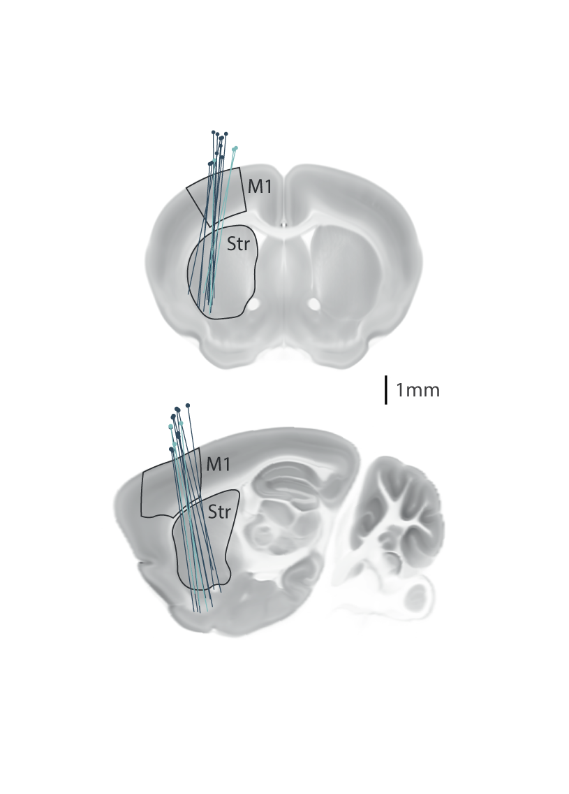

Emmett James Thompson

(Adapted from code by Hernando Martinez: https://github.com/HernandoMV) 

# sequences histology
script for producing projections of probe placements on the allen standard space atlas

See our publication for more details: [Replay of Procedural Experience is Independent of the Hippocampus](https://www.biorxiv.org/content/10.1101/2024.06.05.597547v1.full.pdf).

## Overview

This repository includes:
- example data file for labelled probe start and end points
- sagital and coronal allen standard space atlas images
- an example analysis script that projections of probe placements on the allen standard space atlas

## Prior steps... 
To produce data for this analysis follow these steps:
1. implant a probe copated in dye 
2. Prepere histology (perfusion)
3. Image the enitre brain with serial section microscopy
4. Register the aquired images to the allen standard space with brainreg: https://brainglobe.info/documentation/brainreg/index.html
5. Use fiji or napari to manually find the xyz coordinates of the start and end of each probe track
6. add these coordinates to a txt file like the one provided in example data  

## Requirements 

Ensure you have the following software installed:
- [Git](https://git-scm.com/)
- [Python](https://www.python.org/downloads/)  (Version used: 3.12.3)
- Jupyter notebook
- this analysis requires some standard (very easy to install) python packages
